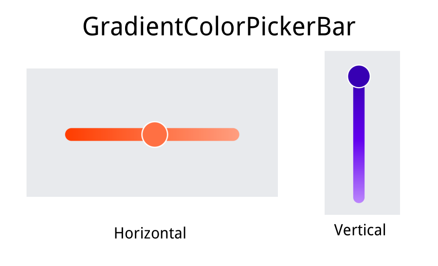

# GradientColorPickerBar

A gradient color picker



## Usage

1. Gradle dependency:
```
allprojects {
    repositories {
        ...
        maven { url 'https://jitpack.io' }
    }
}
```
val version = [](https://jitpack.io/#wangpeiyuan/GradientColorPickerBar)
```
dependencies {
    implementation 'com.github.wangpeiyuan:GradientColorPickerBar:$version'
}
```
2. xml:
```
<com.yuan.gradientcolorpickerbar.GradientColorPickerBar
       android:layout_width="match_parent"
       android:layout_height="match_parent"
       app:barHeight="20dp"
       app:barRadius="22dp"
       app:colorEntries="@array/colors"
       app:orientation="horizontal"
       app:progress="0.5"
       app:thumbRadius="20dp"
       app:thumbSize="40dp"
       app:thumbStrokeColor="@android:color/white"
       app:thumbStrokeWidth="2dp" />
```
3. Kotlin：
```
colorPickerBar.setOnChangeListener(object :
            GradientColorPickerBar.OnChangeListener {

            override fun onStartTrackingTouch(gradientColorPickBar: GradientColorPickerBar) {
                super.onStartTrackingTouch(gradientColorPickBar)
            }

            override fun onProgressChanged(
                gradientColorPickBar: GradientColorPickerBar,
                progress: Float,
                color: Int,
                fromUser: Boolean
            ) {
                //color
            }

            override fun onStopTrackingTouch(gradientColorPickBar: GradientColorPickerBar) {
                super.onStopTrackingTouch(gradientColorPickBar)
            }
        })
```
4. API：
```
//The colors to be distributed along the gradient line
colorPickerBar.setColors(colors: IntArray)
//
colorPickerBar.setProgress(@FloatRange(from = 0.0, to = 1.0) progress: Float)
//Layout be a column or a row
colorPickerBar.setOrientation(orientation: Int)
//
colorPickerBar.setThumbStyle(thumbSize: Float,  thumbRadius: Float, @ColorInt thumbStrokeColor: Int,thumbStrokeWidth: Float)
//
colorPickerBar.setBarStyle(barHeight: Float, barRadius: Float)
//
colorPickerBar.getOrientation():Int
//
colorPickerBar.getProgress():Float
//
colorPickerBar.getSelectedColor():Int
//
colorPickerBar.setOnChangeListener(onChangeListener: OnChangeListener?)
```


## License


Apache License, Version 2.0
